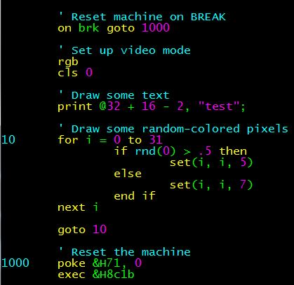
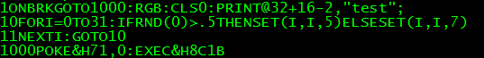

DECBPP: DECB Preprocessor
==========

I'm using my CocoPI in command line mode to edit BASIC programs, drivewire to
mount them on a real Coco3, because entering and editing BASIC code on a Coco makes me rage and scream.

So it occurred to me that this would be a dandy place to put in a preprocessor to minify and optimize the
code being transferred over.  And then once I got that done, why not make it so you don't have to enter all those line numbers?

And so I did!

The code that actually gets sent over is:

Note that there is syntax highlighting for BASIC code on the CocoPI right out of the box.
But it's for QBASIC, not DECB.  To fix that, copy the basic.vim file to _~/.vim/basic.vim_.

Copy decbpp to _/usr/local/bin_.
